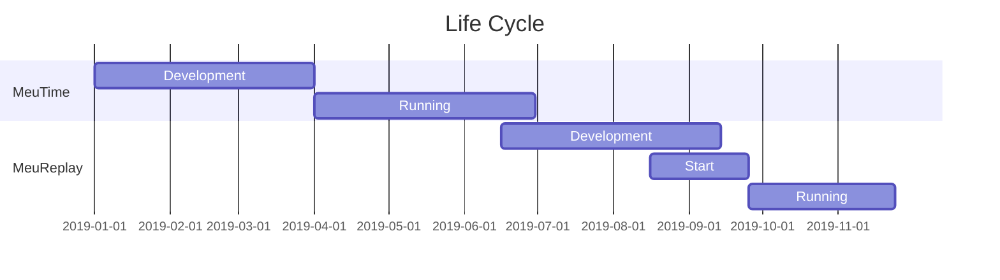

MeuTime - Finanças
===


## Table of Contents

[TOC]


User story
---

> Software arose from the need to split payments in football matches.


```gherkin=
Feature: MeuTime
  Creating groups
  Creation of virtual wallets
  Team cashier control
  Division of the payment of the value of the court between the players
  Savings for purchasing sporting goods
  Transfer of the team's monthly fee to the court owner
```

> Read more about new products here: https://meureplay.online/

Project Timeline
---


Screenshot
---


> This product has been discontinued. Follow our new website : https://meureplay.online/

## Appendix and FAQ

:::info
**Find this document incomplete?** Leave a comment!
:::

###### tags: `MeuTime` `MeuReplay`
